# 🌍 CEMAC Analytics : Infrastructure d'Analyse de Données Économique, Monétaire et Financière

CEMAC Analytics est une infrastructure d'analyse de données économiques, financières, monétaires et bancaires couvrant les six pays de la Zone CEMAC et l'agrégat zone. Développée en autonomie, la plateforme centralise des sources publiques dispersées — BEAC, COBAC, FMI, Banque Mondiale, UN Comtrade, Harvest Asset Management — dans un référentiel unique, structuré et exploitable. Elle combine surveillance automatisée des critères de convergence, tableaux de bord décisionnels et modèles prédictifs, pour transformer la donnée publique en un véritable outil d'aide à la décision.

---

## 📌 Objectifs du Projet

En tant que Business Analyst et Data Engineer, j'ai construit cette plateforme pour répondre à deux défis réels de la zone CEMAC :

* **Asymétrie informationnelle :** Centraliser des données dispersées entre BEAC, COBAC, FMI, Banque Mondiale, UN Comtrade et Harvest Asset Management dans un référentiel unique.
* **Surveillance de la convergence :** Automatiser le suivi des critères de convergence CEMAC — inflation, dette publique, solde budgétaire, réserves de change.
* **Gouvernance augmentée par l'IA :** Intégrer des modèles prédictifs (Prophet, XGBoost) pour projeter les trajectoires économiques sans jamais se substituer à la décision humaine.
* **Analyse bancaire et financière :** Suivre les indicateurs prudentiels COBAC, le marché des titres publics, l'inclusion financière et le Mobile Money.

---

## 📊 Architecture des Tableaux de Bord

| Dashboard | Description | Indicateurs clés |
| :--- | :--- | :--- |
| **Accueil** | Page d'entrée avec navigation vers les 11 tableaux de bord. | Navigation |
| **Alertes & Convergence** | Suivi automatisé des 4 critères de convergence CEMAC. | Score de Risque Composite |
| **Macroéconomie** | Vue consolidée PIB, inflation, secteur extérieur des 6 pays. | PIB nominal, Inflation IPC |
|**PIB Sectoriel** | Structure sectorielle du PIB et prix des matières premières. | Part Agri, Cacao, Bois, Brent |
| **Monétaire & Crédit** | Masse monétaire, crédit à l'économie, TIAO. | M2, Crédit Éco |
| **Finances Publiques** | Recettes, dépenses, soldes budgétaires par pays. | Solde Budgétaire % PIB |
| **Dette** | Encours de dette publique et ses composantes. | Dette Pub. % PIB |
| **Bancaire / COBAC** | Supervision prudentielle des banques commerciales et EMF. | NPL, PNB, Spread TEG/TIAO |
| **Inclusion Financière** | Mobile Money, bancarisation, GIMAC, SYSTAC. | Taux de bancarisation |
| **Marché des Titres** | Émissions BTA/OTA par pays et maturité. | Taux de réalisation |
| **Secteur Extérieur** | Commerce extérieur par filière et partenaire. | Exports/Imports |
| **IA & Prévisions** | Projections Prophet et XGBoost sur 3 horizons. | Prévisions H1/H2/H3 |

---

## 📸 Aperçu des Tableaux de Bord

### Page d'Accueil & Navigation
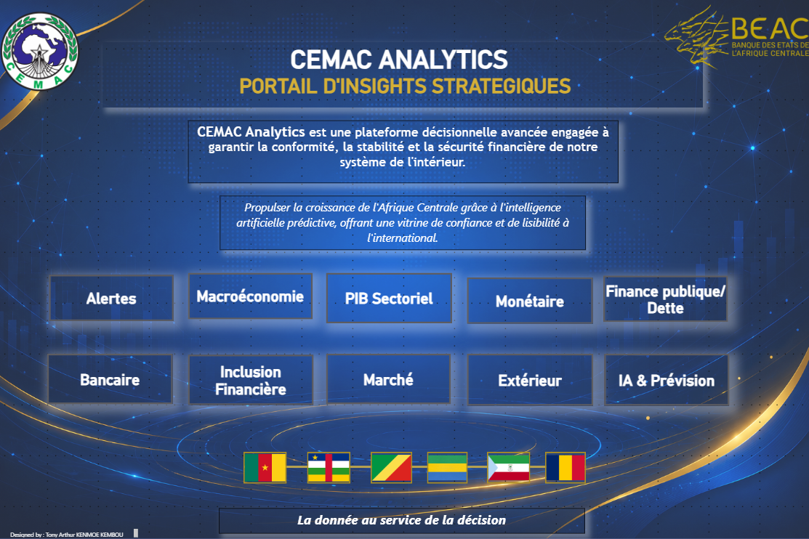

### 1. Alertes & Convergence
*Matrice de convergence et journal d'alertes automatisées.*
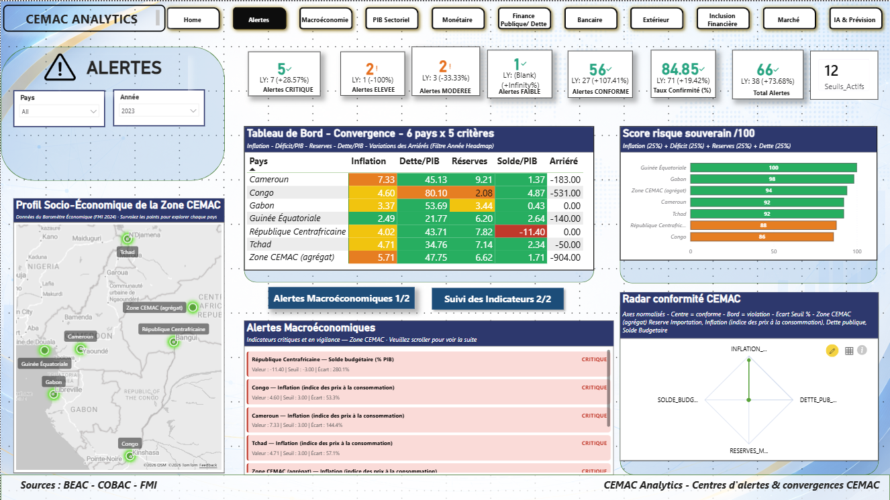

### 2. Macroéconomie
*Vue consolidée PIB, inflation et comparaison des seuils de convergence.*
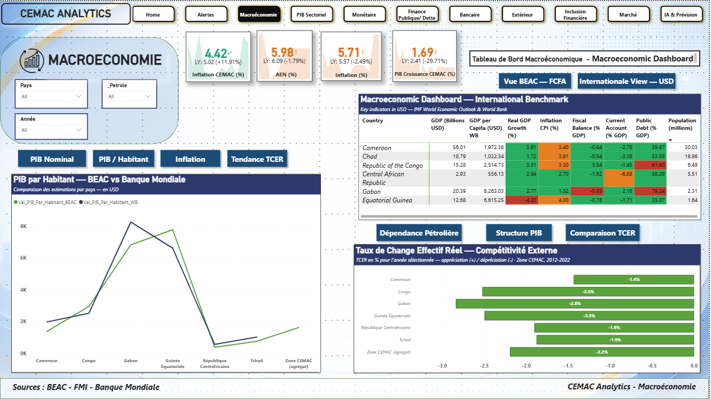

### 3. Monétaire & Crédit
*Masse monétaire, crédit à l'économie et taux directeur.*
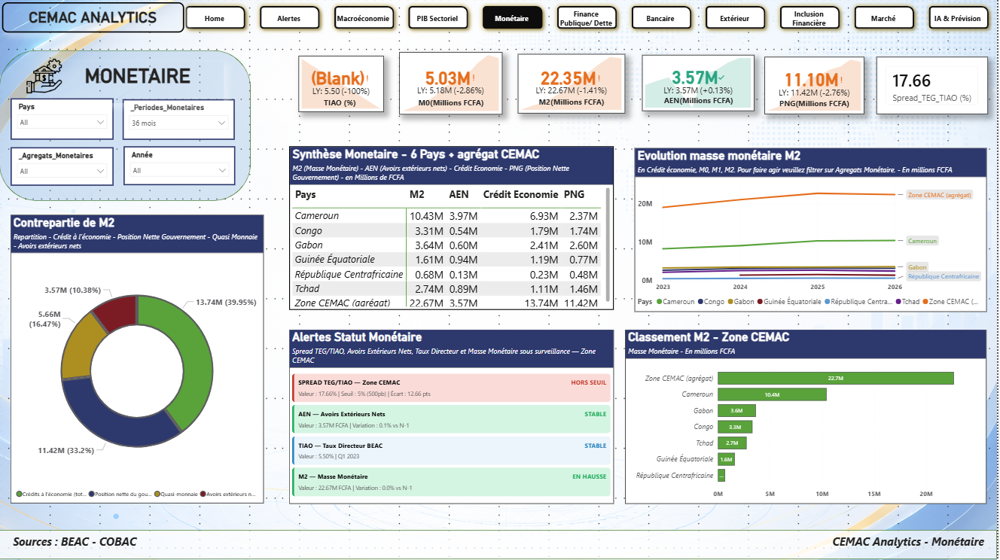

### 4. PIB Sectoriel
*Structure sectorielle du PIB et prix des matières premières.*
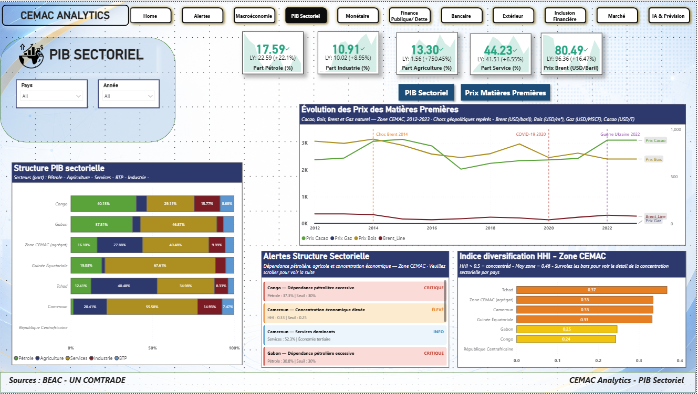

### 5. Finances Publiques & Dette Souveraine
*Recettes, dépenses et soldes budgétaires par pays.* *Encours de dette publique et ses composantes.*
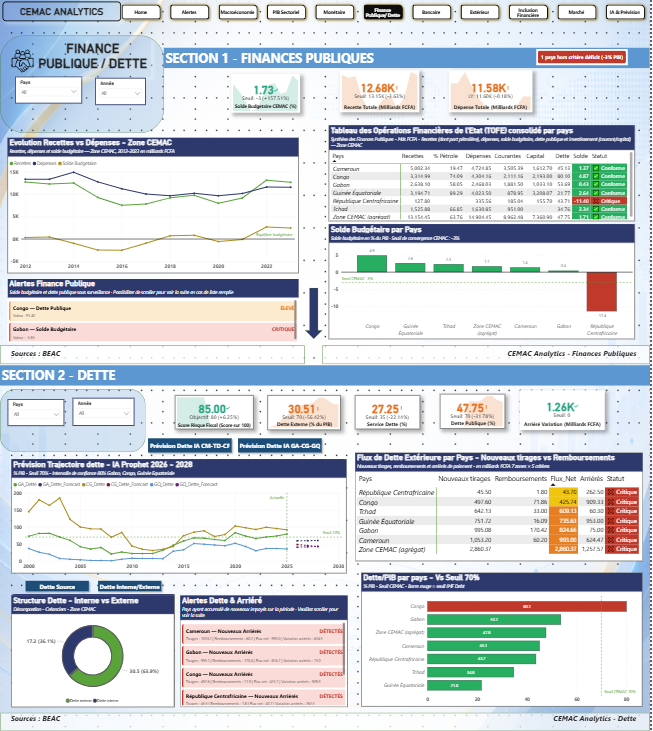

### 6. Bancaire / COBAC
*Supervision prudentielle et indicateurs de risque bancaire.*
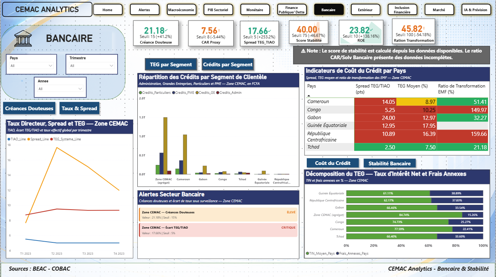

### 7. Secteur Extérieur
*Commerce extérieur par filière et partenaire commercial.*
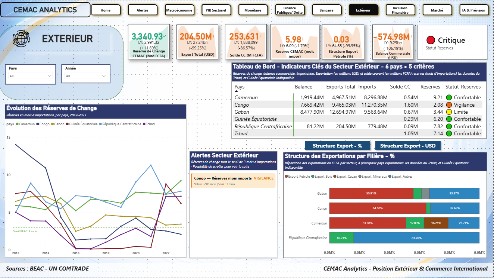

### 8. Inclusion Financière
*Mobile Money, bancarisation et systèmes de paiement.*
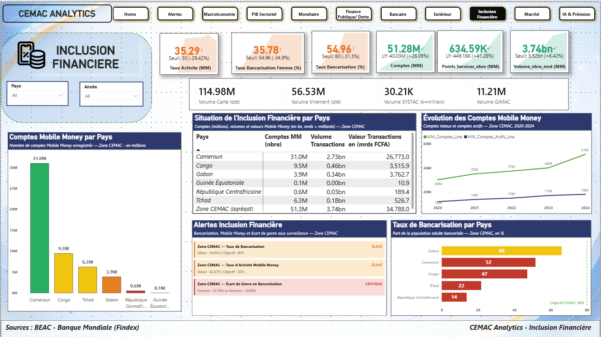

### 9. Marché des Titres
*Émissions BTA/OTA par pays et maturité.*
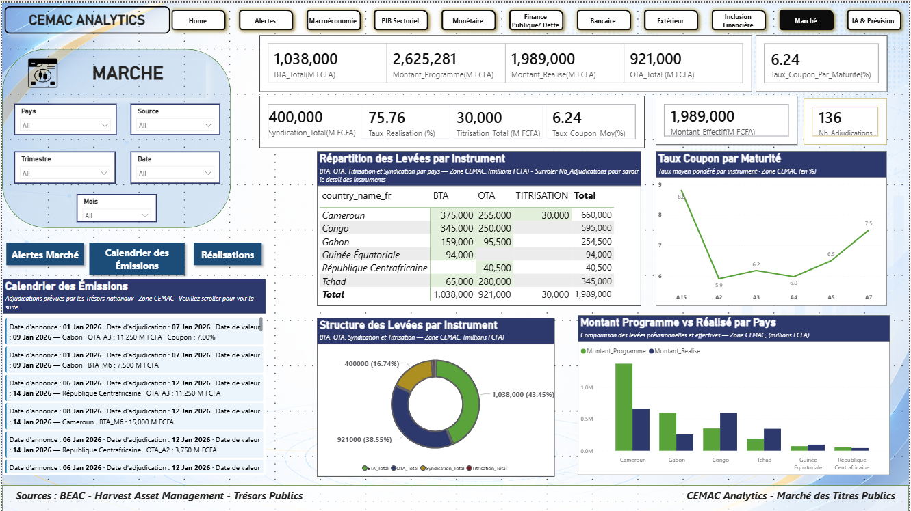

### 10. IA & Prévisions
*Matrice Prophet vs XGBoost avec intervalles de confiance.*
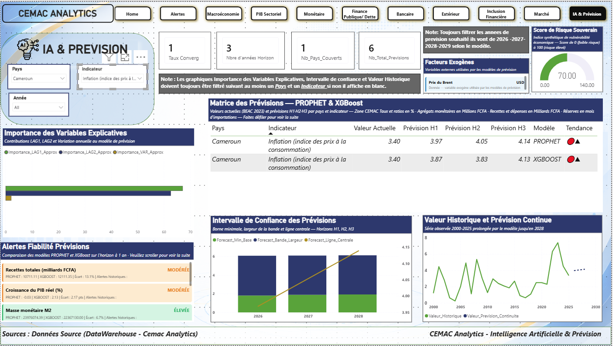

---

## 🔍 Enseignements Stratégiques

* **Deux modèles, deux lectures :** Prophet capture la tendance temporelle avec intervalles de confiance explicites ; XGBoost capture les interactions croisées entre indicateurs — ensemble, ils offrent une vision robuste plutôt qu'un chiffre unique trompeur.
* **La rigueur prime sur la vitesse :** Le moteur d'alertes distingue strictement les données réelles constatées (BEAC/COBAC) des projections (FMI), pour ne jamais confondre un risque anticipé avec un risque avéré.
* **Une seule source de vérité :** L'agrégation de six sources hétérogènes en un entrepôt unique élimine les incohérences entre indicateurs et garantit une traçabilité complète jusqu'à la donnée officielle.

---

## 🚀 Perspectives d'évolution

Le projet est conçu comme une base évolutive, pensée pour s'adapter aux besoins de la zone CEMAC dans la durée.

---

## 🛠️ Stack Technique & Compétences

* **Python :** Scripts de collecte, transformation et chargement (ETL) 
* **PostgreSQL :** Entrepôt de données 
* **Prophet & XGBoost :** Modélisation prédictive multi-horizons.
* **Power BI & DAX :** 10 tableaux de bord, mesures de convergence, moteur d'alertes visuel.
* **Streamlit :** Interface publique BDEMF (Base de Données Économique, Monétaire et Financière).
* **Orchestration :** Pipeline automatisé, de la collecte à l'entraînement des modèles, en une seule exécution.

---

*Projet indépendant — Tony Arthur KENMOE KEMBOU, Business Analyst & Data Engineer, Yaoundé.*
*Certifié Codebasics — Data Analytics Bootcamp 5.0: Job Placement Support + AI Automation & Data Engineering Basics*
